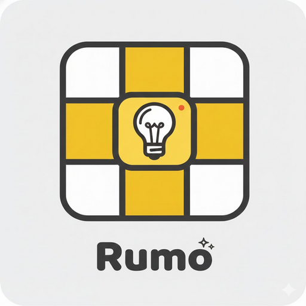
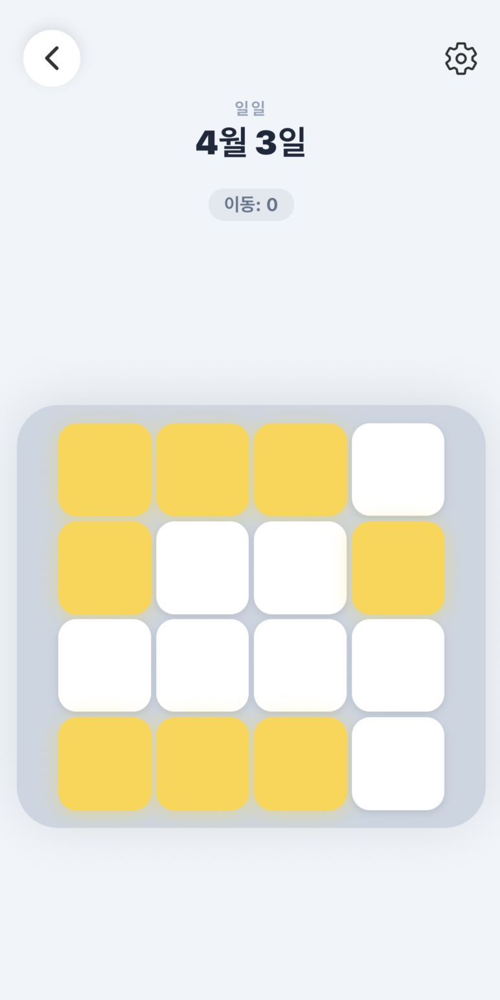
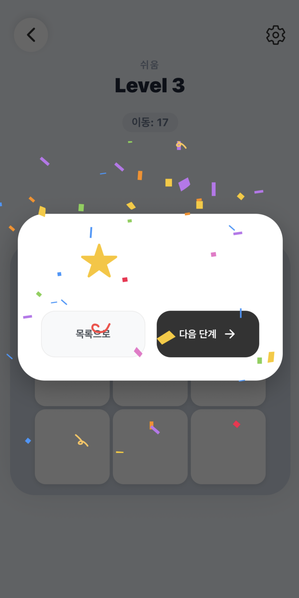
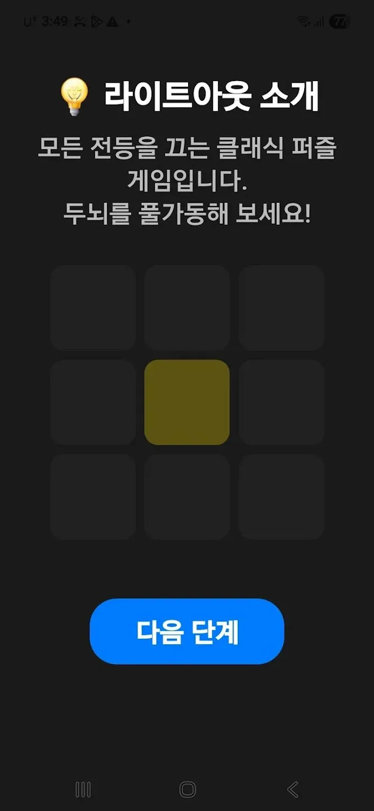

<div align="center">
  
  <h1>Rumo</h1>
  <p>모든 불을 끄는 클래식 로직 퍼즐 게임</p>

  <a href="https://play.google.com/store/apps/details?id=com.jh.rumo&hl=ko">
    
  </a>
  
  
</div>

---

## 📱 스크린샷

| 게임 화면 | 클리어 | 튜토리얼 |
|:---:|:---:|:---:|
|  |  |  |

---

## 🎮 게임 소개

터치한 타일과 **인접한 타일의 상태가 반전**되는 라이트 아웃 퍼즐입니다.  
모든 타일을 꺼서 보드를 비워내세요.

- 규칙은 단순하지만, 풀이는 깊습니다
- 매일 새로운 데일리 퍼즐 제공
- 최소 이동 수에 도전해보세요

---

## ✨ 주요 기능

| 기능 | 설명 |
|---|---|
| 🗂 스테이지 모드 | 난이도별 단계 클리어 |
| 📅 데일리 퍼즐 | 매일 업데이트되는 새 퍼즐 |
| 🏆 클리어 보상 | 별점 & 다음 단계 바로가기 |
| 🎬 Lottie 애니메이션 | 부드러운 UI 전환 효과 |

---

## 🛠 기술 스택

```
React Native / Expo   — SDK 54, Expo Router
Lottie                — 애니메이션
EAS                   — Android 배포
```

---

## 🚀 로컬 실행

```bash
git clone https://github.com/your-repo/rumo.git
cd rumo
npm install
npx expo start
```

---

## 📦 빌드 & 배포

```bash
# Android APK / AAB
eas build --platform android
```

---

<div align="center">
  <sub>Made with 💛 using React Native & Expo</sub>
</div>
